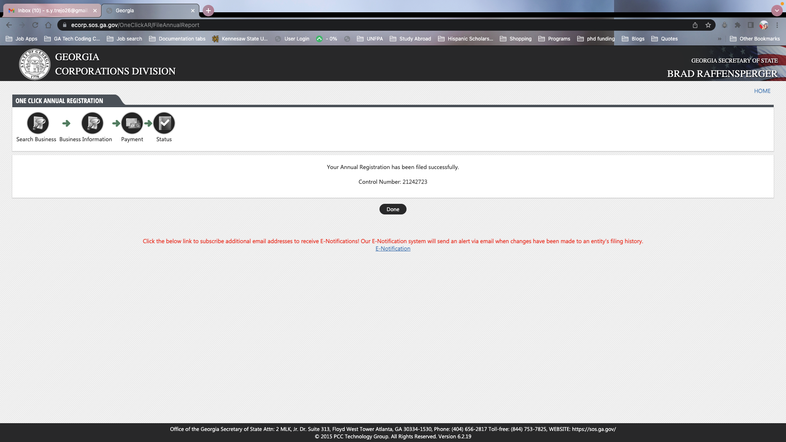

1. [Description](#Description)
2. [Usage](#Usage)
3. [Deployment](#Deployment)
4. [Screenshots](#Screenshots)

## Description

The backend and frontend of a book search app powered by a google api. Users can save their favorite books. They can search information on books they want to learn more about. They can keep all their information on their account which is connected to a database powered by MongoDB.

## Usage

Download the code. Open a terminal. In the terminal type npm i to install the dependencies. Then, type npm start to initiate the server in the localhost.

To use the app, visit the deployment page in Heroku. It is a very intuitive page.

## Deployment
Repo Link: [Github Repo](https://github.com/sytrejo/reactBookSearch)
Heroku Link: [Heroku Deployment](https://sytrejobooksearch.herokuapp.com/)

## Screenshots

